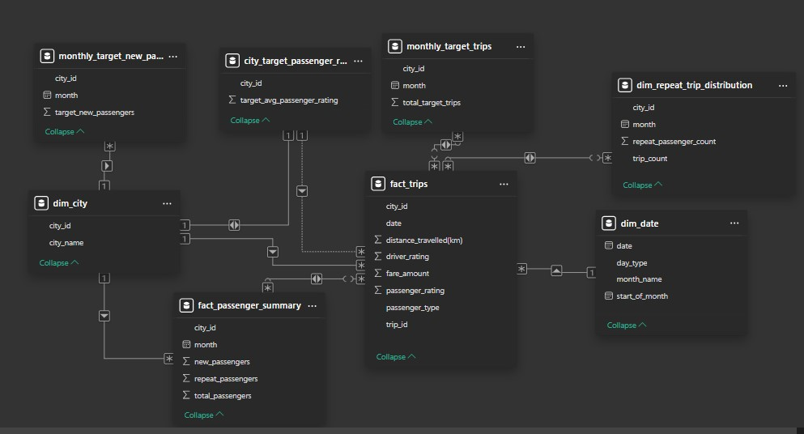

# Cab Service Analysis

                                                   

# Project Overview
- The ride-hailing industry is witnessing a rapid transformation, driven by increasing urbanization, evolving consumer preferences, and intensified competition. **Good Cabs**, operating in multiple tier-2 cities, is at a critical juncture where optimizing business operations and improving service quality are pivotal to sustaining long-term growth. While expanding market reach is crucial, ensuring high levels of customer satisfaction and operational efficiency is equally vital to maintain a competitive edge.

- To remain profitable, the company must address key operational and business challenges:

   - **Fluctuating Demand Patterns:** Understanding how trip demand varies by city, time of day, and customer segment is essential for better resource allocation.
   - **Customer Retention vs. Acquisition:** Acquiring new passengers is costly, making repeat customer retention a more sustainable growth strategy. Analyzing repeat ride trends helps identify loyalty drivers.
   - **Revenue Maximization:** Fare optimization and ride frequency play a crucial role in increasing revenue. The project explores the correlation between trip frequency, fare structures, and total revenue generation.
   - **Performance vs. Strategic Targets:** Good Cabs sets operational and financial benchmarks, such as total trip targets and passenger acquisition goals. This project evaluates actual performance against these goals, identifying gaps and improvement areas.
     
- Through in-depth data analysis, this project uncovers actionable insights that will guide strategic decision-making, allowing Good Cabs to refine its operational approach, enhance financial planning, and improve overall service delivery.

# Data Description

This project processes 426,885 records spanning trip data, customer behavior, and business performance metrics to provide a comprehensive analytical foundation for Good Cabs' operations. The datasets are categorized into two key domains: Operational Trip Data and Business Targets, each facilitating strategic decision-making and service optimization.

1. Operational Trip Data ``trips_db``
 - This dataset offers a granular view of Good Cabs' ride activity, providing the foundation for demand forecasting, service efficiency, and customer segmentation.

  - Geographic Reference `dim_city` – Defines city identifiers and names for location-based analysis.
  - Time-Series Data `dim_date` – Structures ride records across time dimensions, distinguishing between weekdays and weekends to analyze demand fluctuations.
  - Ride Transactions `fact_trips` – Contains detailed trip-level data, including fare amounts, trip distances, and passenger/driver ratings, supporting financial and operational insights.
   - Customer Segmentation `fact_passenger_summary` – Aggregates passenger counts by city and month, enabling retention trend analysis and service personalization.
   - Repeat Rider Behavior `dim_repeat_trip_distribution` – Captures frequency-based ride patterns, identifying engagement levels among returning customers.
     
2. Business Targets & Performance Metrics ``targets_db``
  - The second dataset defines monthly business objectives and operational benchmarks, allowing for structured performance evaluations.

  - Trip Completion Goals `monthly_target_trips` – Establishes monthly trip targets per city to measure demand fulfillment.
  - New Customer Acquisition `monthly_target_new_passenger` – Sets growth targets for first-time passengers, helping assess market expansion efforts.
  - Passenger Experience `city_target_passenger_rating` – Defines expected passenger ratings to track and enhance service quality.

By leveraging this data-driven approach, Good Cabs can align its operational performance with strategic business goals, improve customer engagement, and refine decision-making to maximize efficiency and profitability.

# Data Exploration and Analysis

- **Schema Validation & Data Integrity**
  - Executed rigorous SQL scripts in PostgreSQL to validate schema relationships between tables (e.g., `dim_city`, `dim_date`, and `fact_trips`).
  - Applied referential integrity checks and constraints to ensure data consistency across 425K+ trip records.

- **Advanced SQL Techniques**
  - Utilized window functions (e.g., `ROW_NUMBER()`, `RANK()`) and Common Table Expressions (CTEs) to perform multi-level aggregations.
  - Designed complex JOINs and subqueries to merge operational data with business targets for comprehensive analysis.

- **Data Aggregation & Transformation**
  - Generated detailed metrics on trip volumes, fare structures, and passenger segmentation.
  - Calculated key performance indicators such as monthly retention rates and revenue distributions, segmented by city and time period.

- **Static Reporting with Power BI**
    - Exported aggregated datasets to Power BI for creating static, visually-rich summary reports.
    - Developed reports covering:
        1. Trip distribution across cities
        2. Weekday vs. weekend trends
        3. Cumulative contributions of repeat passenger trips
        4. Monthly revenue performance and target achievements

- **Technical Outcome**
  - Demonstrated a robust and reproducible workflow that transforms raw operational data into actionable insights through advanced PostgreSQL querying and high-quality static visual reporting.

For complete scripts and reports, refer to:
- [PostgreSQL Scripts](SQL_Scripts/trips_db_postgresql_script.sql)
- [Good Cabs Summary Report (PBIX)](good_cabs_summary_report.pbix) | [PDF Version](good_cabs_summary_report.pdf)

