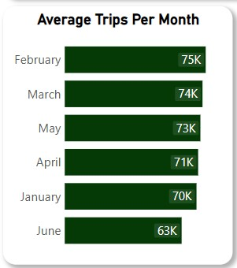
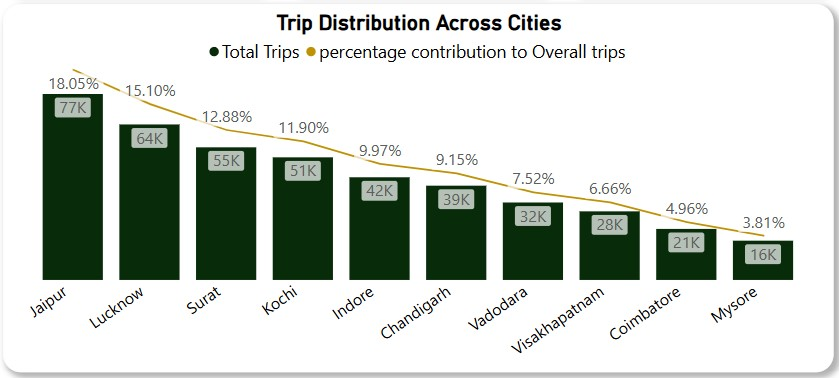
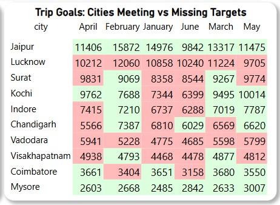
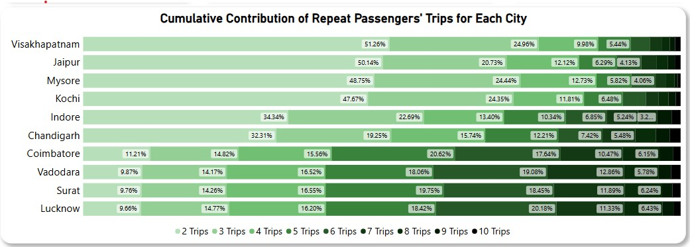
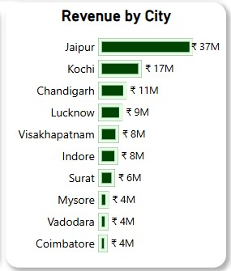
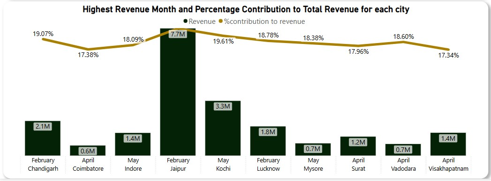
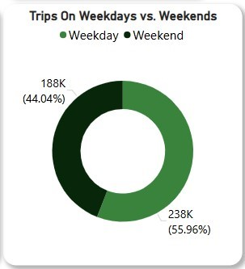
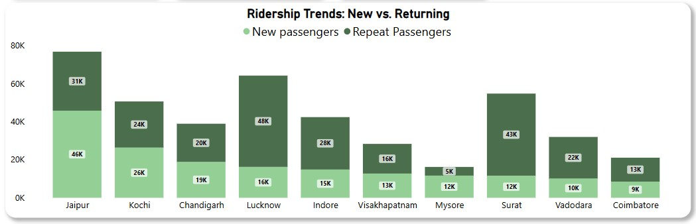
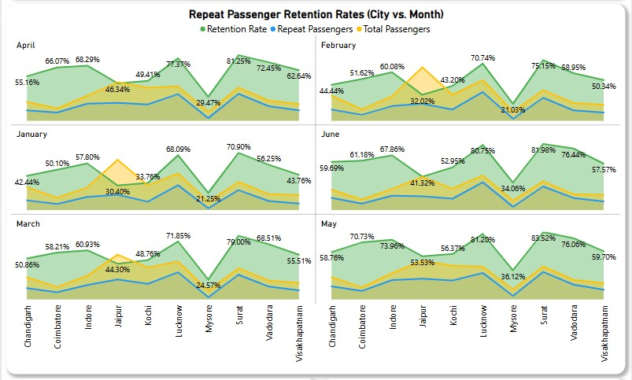
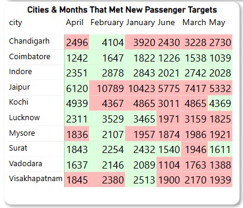

# Cab Service Analysis

                                                   

# Project Overview
- The ride-hailing industry is witnessing a rapid transformation, driven by increasing urbanization, evolving consumer preferences, and intensified competition. **Good Cabs**, operating in multiple tier-2 cities, is at a critical juncture where optimizing business operations and improving service quality are pivotal to sustaining long-term growth. While expanding market reach is crucial, ensuring high levels of customer satisfaction and operational efficiency is equally vital to maintain a competitive edge.

- To remain profitable, the company must address key operational and business challenges:

   - **Fluctuating Demand Patterns:** Understanding how trip demand varies by city, time of day, and customer segment is essential for better resource allocation.
   - **Customer Retention vs. Acquisition:** Acquiring new passengers is costly, making repeat customer retention a more sustainable growth strategy. Analyzing repeat ride trends helps identify loyalty drivers.
   - **Revenue Maximization:** Fare optimization and ride frequency play a crucial role in increasing revenue. The project explores the correlation between trip frequency, fare structures, and total revenue generation.
   - **Performance vs. Strategic Targets:** Good Cabs sets operational and financial benchmarks, such as total trip targets and passenger acquisition goals. This project evaluates actual performance against these goals, identifying gaps and improvement areas.
     
- Through in-depth data analysis, this project uncovers actionable insights that will guide strategic decision-making, allowing Good Cabs to refine its operational approach, enhance financial planning, and improve overall service delivery.

# Data Description

This project processes 426,885 records spanning trip data, customer behavior, and business performance metrics to provide a comprehensive analytical foundation for Good Cabs' operations. The datasets are categorized into two key domains: Operational Trip Data and Business Targets, each facilitating strategic decision-making and service optimization.

1. **Operational Trip Data ``trips_db``**
    - This dataset offers a granular view of Good Cabs' ride activity, providing the foundation for demand forecasting, service efficiency, and customer segmentation.
    - Geographic Reference `dim_city` – Defines city identifiers and names for location-based analysis.
    - Time-Series Data `dim_date` – Structures ride records across time dimensions, distinguishing between weekdays and weekends to analyze demand fluctuations.
    - Ride Transactions `fact_trips` – Contains detailed trip-level data, including fare amounts, trip distances, and passenger/driver ratings, supporting financial and operational insights.
   - Customer Segmentation `fact_passenger_summary` – Aggregates passenger counts by city and month, enabling retention trend analysis and service personalization.
   - Repeat Rider Behavior `dim_repeat_trip_distribution` – Captures frequency-based ride patterns, identifying engagement levels among returning customers.
     
2. **Business Targets & Performance Metrics ``targets_db``**
   - The second dataset defines monthly business objectives and operational benchmarks, allowing for structured performance evaluations.
   - Trip Completion Goals `monthly_target_trips` – Establishes monthly trip targets per city to measure demand fulfillment.
   - New Customer Acquisition `monthly_target_new_passenger` – Sets growth targets for first-time passengers, helping assess market expansion efforts.
   - Passenger Experience `city_target_passenger_rating` – Defines expected passenger ratings to track and enhance service quality.

By leveraging this data-driven approach, Good Cabs can align its operational performance with strategic business goals, improve customer engagement, and refine decision-making to maximize efficiency and profitability.

# Data Exploration and Analysis

- **Schema Validation & Data Integrity**
  - Executed rigorous SQL scripts in PostgreSQL to validate schema relationships between tables (e.g., `dim_city`, `dim_date`, and `fact_trips`).
  - Applied referential integrity checks and constraints to ensure data consistency across 425K+ trip records.

- **Advanced SQL Techniques**
  - Utilized window functions (e.g., `ROW_NUMBER()`, `RANK()`) and Common Table Expressions (CTEs) to perform multi-level aggregations.
  - Designed complex JOINs and subqueries to merge operational data with business targets for comprehensive analysis.

- **Data Aggregation & Transformation**
  - Generated detailed metrics on trip volumes, fare structures, and passenger segmentation.
  - Calculated key performance indicators such as monthly retention rates and revenue distributions, segmented by city and time period.

- **Static Reporting with Power BI**
    - Exported aggregated datasets to Power BI for creating static, visually-rich summary reports.
    - Developed reports covering:
        1. Trip distribution across cities
        2. Weekday vs. weekend trends
        3. Cumulative contributions of repeat passenger trips
        4. Monthly revenue performance and target achievements

- **Technical Outcome**
  - Demonstrated a robust and reproducible workflow that transforms raw operational data into actionable insights through advanced PostgreSQL querying and high-quality static visual reporting.

For complete scripts and reports, refer to:
- [PostgreSQL Scripts](SQL_Scripts/trips_db_postgresql_script.sql)
- [Good Cabs Summary Report (PBIX)](good_cabs_summary_report.pbix) | [PDF Version](good_cabs_summary_report.pdf)

# Key Findings & Insights

1. **Scale and Composition**
   - The dataset includes 426K+ trips and provides insights into 426K total passengers, split as 177K new and 249K repeat.
   - This scale enables granular analysis by city (e.g., Jaipur, Kochi, Chandigarh, Coimbatore, Mysore) and by month over 182 days.

2. **Monthly Trends**
   - Average monthly trip counts range from 63K in June to 75K in February.
   - For example, January shows an average of 70K trips, while peak activity is observed in February and a noticeable dip occurs in June.
     
     
     
     

3. **City-Specific Performance**
   - **High-Performing Cities:**
     - *Jaipur* stands out with ₹37M in revenue, driven by a peak month contribution of 19.07%.
     - *Kochi* and *Chandigarh* also perform strongly with revenues of ₹17M and ₹11M, respectively.
   - **Underperforming/Challenged Markets:**
     - In contrast, cities like *Coimbatore* and *Mysore* tend to lag, reflecting lower revenue and less robust operational metrics.
     - Such metrics highlight the revenue concentration in high-demand markets while signaling areas for operational improvement in weaker regions.
     
      
      

4. **Temporal Demand Distribution**
   - Analysis shows that 55.96% of trips occur during weekdays and 44.04% during weekends.
   - This consistent weekday bias is critical for staffing and operational planning, suggesting that cities with a stronger weekday demand (e.g., Jaipur, Kochi) may require more aggressive scheduling than those with a higher weekend proportion.
   

5. **Customer Retention & Repeat Usage**
   - Repeat passenger contributions in select cities are approximately 51.26%, 50.14%, and 48.75%.
   - Retention rates across cities vary significantly—from as low as 21% in some underperforming markets like Coimbatore to as high as 83.52% in stronger markets such as Jaipur.
   - These insights emphasize the need for targeted customer engagement strategies tailored to each city and month.
   
  
  
  
# Business Recommendations

- **Dynamic Fleet Management**
  
  - **Peak Demand (February):**
     - During February, when average monthly trips reach up to 75K, high-performing cities such as Jaipur report peak revenue levels, with figures reaching as high as ₹37M.
     - **Recommendation:** Expand driver availability by increasing shift slots, incentivizing extra hours, and potentially onboarding additional temporary drivers to capitalize on the high demand.
     - **Expected Outcome:** Maximized trip capture, reduced wait times, and increased overall revenue during the peak season.
       
  - **Off-Peak Adjustments (June):**
     - In contrast, during June, average trip volumes dip to around 63K, indicating a softer demand period.
     - **Recommendation:** Reallocate resources from consistently high-performing markets (e.g., Jaipur and Kochi) to support lower-performing regions like Coimbatore and Mysore.
    
   - **Action Items:** 
      - Temporarily reduce driver shifts in peak regions.
      - Deploy targeted promotions and driver incentives in lower-demand cities to boost ride volumes.
      - **Expected Outcome:** Improved service levels in underperforming areas and a more balanced operational footprint across all regions.
        
- **Optimized Driver Scheduling**
  - **Weekday Focus:**
     - With 55.96% of trips occurring on weekdays, it is essential to optimize driver schedules to align with this higher volume.
     - **Recommendation:** Prioritize weekday driver scheduling by creating flexible shift patterns that match high-demand periods in cities such as Jaipur and Kochi.
     - **Action Items:**
         1. Introduce performance-based incentives for drivers who work during peak weekday hours.
         2. Utilize historical trip data to predict and pre-schedule shifts during forecasted busy periods.
         3. **Expected Outcome:** Enhanced operational efficiency, reduced customer wait times, and increased trip completions during weekdays.
  
  - **Weekend Initiatives:**
    - Although weekend activity accounts for 44.04% of trips, there is an opportunity to elevate performance during these periods.
    - **Recommendation:** Launch targeted promotions or offer flexible driver shifts on weekends, especially in markets where weekend activity lags.
    - **Action Items:**
        1. Implement weekend-specific discounts to stimulate rider demand.
        2. Adjust driver incentives to encourage weekend availability in cities with lower off-peak volumes.
        3. **Expected Outcome:** Better distribution of trips across the week and improved utilization of the driver fleet on weekends.

- **Integrated Feedback & Improvement**
   - **Continuous Monitoring:** Establish a robust monitoring framework that tracks key performance indicators such as retention rates and satisfaction metrics in real time. For instance, with driver ratings averaging in *Surat* 6.59 and passenger ratings at 6.42, use these metrics to identify specific service areas that need enhancement. This includes integrating customer surveys, post-ride feedback, and automated data collection tools to create a comprehensive view of service quality.
     
   - **Data-Driven Adjustments:** Use the insights gathered from these metrics to adjust operational tactics. For example, if the quality gap between driver and passenger ratings persists, consider targeted driver training programs, incentive adjustments, or process improvements in the ride experience.
     
   - **Quarterly Reviews:** Implement structured quarterly performance reviews that bring together cross-functional teams to analyze the latest data trends. These sessions should focus on evaluating the effectiveness of current loyalty programs and customer acquisition strategies, and then fine-tuning them based on evolving market dynamics. This iterative approach ensures that the company remains agile and responsive to changes, driving continuous improvement across all service touchpoints.

- **Customized Regional Engagement**
  - **Hyper-Localized Promotions:** 
     - Develop marketing initiatives that are tailored to the unique characteristics and performance metrics of each city. For instance, in high-potential markets like Jaipur, where revenue and retention rates are robust, derive best practices such as premium customer rewards and targeted referral programs. Use these strategies as a blueprint for similar high-growth regions.
     - In contrast, for lower-performing cities, implement more personalized campaigns that address local challenges—such as offering introductory discounts, localized loyalty rewards, or community-focused events—to stimulate both new customer acquisition and repeat usage.
      
  - **Data-Driven Segmentation:** 
     - Utilize customer segmentation derived from analytics to gain detailed insights into the behavioral differences between new and repeat customers. This analysis helps identify distinct preferences, spending patterns, and service expectations.
     - Based on these insights, adjust promotional offers accordingly—for example, providing first-time ride discounts for new users, and exclusive benefits or loyalty bonuses for repeat riders—ensuring that marketing efforts are precisely aligned with customer needs across different regions.

