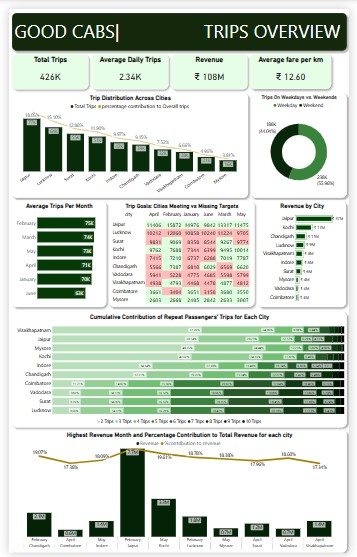

# Cab Service Analysis
                               

# Project Overview
- The ride-hailing industry is witnessing a rapid transformation, driven by increasing urbanization, evolving consumer preferences, and intensified competition. **Good Cabs**, operating in multiple tier-2 cities, is at a critical juncture where optimizing business operations and improving service quality are pivotal to sustaining long-term growth. While expanding market reach is crucial, ensuring high levels of customer satisfaction and operational efficiency is equally vital to maintain a competitive edge.

- To remain profitable, the company must address key operational and business challenges:

   - **Fluctuating Demand Patterns:** Understanding how trip demand varies by city, time of day, and customer segment is essential for better resource allocation.
   - **Customer Retention vs. Acquisition:** Acquiring new passengers is costly, making repeat customer retention a more sustainable growth strategy. Analyzing repeat ride trends helps identify loyalty drivers.
   - **Revenue Maximization:** Fare optimization and ride frequency play a crucial role in increasing revenue. The project explores the correlation between trip frequency, fare structures, and total revenue generation.
   - **Performance vs. Strategic Targets:** Good Cabs sets operational and financial benchmarks, such as total trip targets and passenger acquisition goals. This project evaluates actual performance against these goals, identifying gaps and improvement areas.
     
- Through in-depth data analysis, this project uncovers actionable insights that will guide strategic decision-making, allowing Good Cabs to refine its operational approach, enhance financial planning, and improve overall service delivery.

